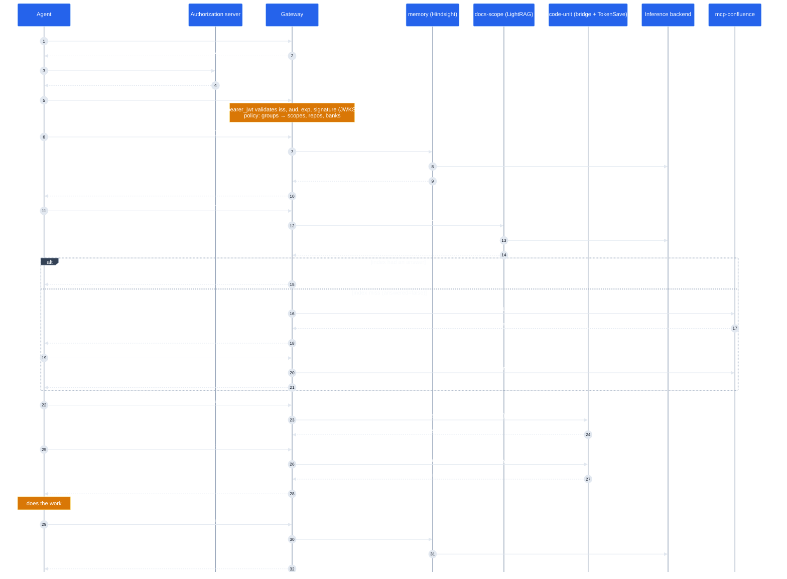

# Architecture

One MCP endpoint per developer. Behind it, contracts: the gateway and the ingest engine depend only on
`cerebro/core/contracts`, every engine is an adapter chosen by `type:` in `cerebro.yaml`, and a provisioner turns the
adapters' unit templates into workloads. The inference backend is the only place text leaves the boundary.

## System

```mermaid
%%{init: {
  "theme": "base",
  "themeVariables": {
    "fontFamily": "system-ui, -apple-system, Segoe UI, Roboto, Helvetica, Arial, sans-serif",
    "fontSize": "14px",
    "background": "#0b1220",
    "primaryColor": "#334155",
    "primaryTextColor": "#ffffff",
    "primaryBorderColor": "#94a3b8",
    "secondaryColor": "#334155",
    "tertiaryColor": "#1f2937",
    "textColor": "#f8fafc",
    "titleColor": "#f8fafc",
    "lineColor": "#cbd5e1",
    "clusterBkg": "#1f2937",
    "clusterBorder": "#64748b",
    "edgeLabelBackground": "#1e293b",
    "nodeTextColor": "#ffffff"
  },
  "flowchart": { "curve": "basis", "nodeSpacing": 30, "rankSpacing": 55, "padding": 12 }
}}%%
flowchart LR
    classDef client fill:#0369a1,stroke:#7dd3fc,stroke-width:2px,color:#ffffff
    classDef auth fill:#475569,stroke:#cbd5e1,stroke-width:2px,color:#ffffff
    classDef gateway fill:#2563eb,stroke:#bfdbfe,stroke-width:2.5px,color:#ffffff
    classDef port fill:#1e40af,stroke:#93c5fd,stroke-width:1.5px,stroke-dasharray:3 2,color:#ffffff
    classDef docs fill:#7c3aed,stroke:#ddd6fe,stroke-width:2px,color:#ffffff
    classDef code fill:#059669,stroke:#a7f3d0,stroke-width:2px,color:#ffffff
    classDef memory fill:#d97706,stroke:#fde68a,stroke-width:2px,color:#ffffff
    classDef infra fill:#64748b,stroke:#e2e8f0,stroke-width:2px,color:#ffffff
    classDef job fill:#475569,stroke:#e2e8f0,stroke-width:2px,stroke-dasharray:4 3,color:#ffffff
    classDef external fill:#374151,stroke:#d1d5db,stroke-width:2px,stroke-dasharray:5 4,color:#f9fafb
    classDef model fill:#e11d48,stroke:#fecdd3,stroke-width:2.5px,color:#ffffff

    subgraph DEV[" Developers and CI "]
        direction TB
        CC["Claude Code"]:::client
        CU["Cursor / other MCP clients"]:::client
    end

    subgraph AS[" Authorization server (identity.mode) "]
        KC["builtin: Keycloak unit<br/><small>or external: your IdP<br/>or none: no tokens</small>"]:::auth
    end

    subgraph STACK[" Self-hosted boundary: units the provisioner runs (compose or Kubernetes) "]
        direction LR
        subgraph GWB[" gateway "]
            direction TB
            GW["<b>MCP gateway</b><br/><small>whoami · list_scopes · query_docs · live_search · live_fetch<br/>search_code · list_code_units · code_tool · recall · retain · reflect</small>"]:::gateway
            ID["IdentityProvider<br/><small>bearer_jwt · bearer_introspect<br/>none · static · trusted_headers</small>"]:::port
            POL["AccessPolicy<br/><small>groups → scopes, repos, banks</small>"]:::port
            PORTS["DocumentIndex · CodeIntelligence · MemoryStore<br/><small>adapters: lightrag · tokensave · hindsight</small>"]:::port
            GW --- ID --- POL --- PORTS
        end

        subgraph SCOPE[" per scope (×N) "]
            direction TB
            LRAG["docs-&lt;scope&gt;<br/><small>LightRAG server</small>"]:::docs
            CU1["code-&lt;scope&gt; or code-&lt;scope&gt;-&lt;repo&gt;<br/><small>bridge + TokenSave + ripgrep<br/>/health · /mcp · capabilities manifest</small>"]:::code
        end

        HS["memory<br/><small>Hindsight · banks user-&lt;id&gt; / team-&lt;group&gt;</small>"]:::memory

        subgraph PIPE[" Pipelines "]
            direction TB
            ING["ingest<br/><small>plugins: confluence · backstage · git · files · jama<br/>SyncState in json_file or postgres</small>"]:::job
            IDX["index-&lt;unit&gt; job<br/><small>clone, tokensave init / sync / branch add</small>"]:::job
        end

        MCPA["mcp-&lt;plugin&gt;<br/><small>upstream declared by a plugin<br/>(mcp-atlassian)</small>"]:::job

        subgraph INFRA[" Shared "]
            direction TB
            PG[("postgres<br/><small>pgvector · db per engine</small>")]:::infra
            PROV["Provisioner<br/><small>compose / kubernetes · Locator · idle TTL</small>"]:::port
        end
    end

    subgraph MODEL[" Inference backend: the only place text leaves the stack "]
        LLM["ollama unit (in-stack)<br/><i>or</i> host Ollama<br/><i>or</i> org-approved OpenAI-compatible endpoint"]:::model
    end

    subgraph SRC[" Your systems (read-only) "]
        direction TB
        CONF["Confluence · Jama"]:::external
        BS["Backstage"]:::external
        GIT["Code host"]:::external
    end

    CC & CU -->|"bearer token (PKCE)"| GW
    CC & CU -.->|"login"| KC
    KC -.->|"JWKS / introspection"| ID
    PORTS -->|"caller's scopes"| LRAG
    PORTS -->|"units of the caller's repos"| CU1
    PORTS -->|"caller's banks"| HS
    GW -.->|"index miss: same scopes"| MCPA -.-> CONF

    CONF & BS --> ING
    GIT --> ING
    GIT --> IDX
    ING -->|"one Batch per scope"| LRAG
    IDX -->|"shared volume"| CU1

    LRAG -.->|"extraction · answers · embeddings"| LLM
    HS -.-> LLM
    LRAG & HS --> PG
    PROV -.->|"ensure / release / render"| SCOPE

    style STACK fill:#1e293b,stroke:#94a3b8,stroke-width:2.5px,color:#f8fafc
    style GWB fill:#1e3a8a,stroke:#93c5fd,stroke-width:2px,color:#f8fafc
    style SCOPE fill:#312e81,stroke:#c4b5fd,stroke-width:2px,color:#f8fafc
    style PIPE fill:#334155,stroke:#94a3b8,stroke-width:2px,color:#f8fafc
    style INFRA fill:#334155,stroke:#94a3b8,stroke-width:2px,color:#f8fafc
    style MODEL fill:#881337,stroke:#fda4af,stroke-width:2.5px,stroke-dasharray:6 4,color:#fff1f2
    style DEV fill:#0c4a6e,stroke:#7dd3fc,stroke-width:2px,color:#f0f9ff
    style AS fill:#334155,stroke:#cbd5e1,stroke-width:2px,color:#f8fafc
    style SRC fill:#1f2937,stroke:#9ca3af,stroke-width:2px,stroke-dasharray:5 4,color:#f9fafb
```

**Reading it**

- **Blue** is the only thing agents talk to. The identity middleware resolves every request to a `Principal`
  (subject, groups, token scopes), the policy turns it into `Grants` (scopes, repos, banks), and every tool checks
  its token scope and then the grants for whatever it touches. Tools never read headers or tokens.
- **Dashed blue** boxes are the ports: in-process contracts the gateway calls. Swapping an engine is a `type:` change.
- **Purple and green** are per scope: a document graph and a code index merge knowledge across their inputs, so the
  access boundary is the index itself. Code units can be one per scope (repos side by side) or one per repository.
- **Amber** is shared but partitioned by bank: `user-<id>` private, `team-<group>` shared with that IdP group.
- **Red** is the one outbound dependency. LightRAG and Hindsight send text there; TokenSave and Keycloak do not.
- **Dashed grey** are read-only systems; nothing is written back. The dashed edge from the gateway is the live
  fallback: an index miss searches the system of record for the same scopes and returns refs for `live_fetch`.
- The **Provisioner** is also the Locator: adapters ask it for `http://<unit>:<port>` instead of embedding names.

Colours are set explicitly (dark palette), so the diagrams render the same on GitHub light and dark themes.

## One task, end to end

Every hop downstream of the gateway carries a service credential clients never see (`LIGHTRAG_API_KEY`,
`HINDSIGHT_API_KEY`); the code units have no auth and are reachable only on the stack network.

## Contracts

`cerebro/core/contracts/` is the whole dependency surface of the gateway and the ingest engine. One module per kind;
an adapter subclasses exactly one and is found by `cerebro.adapters.<kind>.<type>:Adapter` (in tree) or
`module:Class` (out of tree).

| Module | Contract | Verbs |
|---|---|---|
| `identity.py` | `IdentityProvider`, `AuthorizationServer` | `resolve(request) -> Principal`, `challenge()`, `protected_resource_metadata()`; `issuer()`, `seed(users, groups, resource_id)` |
| `policy.py` | `AccessPolicy` | `grants(principal) -> Grants` |
| `docs.py` | `DocumentIndex` | `apply(scope, Batch)`, `query(scope, q, QueryOptions) -> DocAnswer`, `health(scope)`, optional `stats(scope)` |
| `code.py` | `CodeIntelligence` | `capabilities(unit)`, `search(unit, query, repos, branch, regex)`, `call(unit, tool, args, branch)`, `health(unit)` |
| `memory.py` | `MemoryStore` | `recall(bank, query, budget)`, `retain(bank, content)`, optional `reflect(bank, query)`, `health()` |
| `inference.py` | `Inference` | `chat(messages)`, `embed(texts)`, `health()` |
| `provision.py` | `Provisioner` (also a `Locator`) | `ensure(UnitSpec) -> Endpoint`, `release(unit)`, `status(unit)`, `run_job(JobSpec)`, `render(units, jobs)`, `touch(unit)`, `endpoint(unit)` |
| `state.py` | `SyncState` | `get(key)`, `keys_with_prefix(prefix)`, `commit(set, delete)` |
| `sources.py` | `Plugin`, `Source`, `LiveSource`, `McpUpstream` | the knowledge-source plugin contract (see [PLUGINS.md](PLUGINS.md)) |

Every adapter also inherits `units()` and `jobs()` from `cerebro.core.context.Adapter`: the `UnitSpec` / `JobSpec`
templates the provisioner runs for it. Provisioned engine units satisfy one wire contract: `GET /health`,
`POST /mcp` (streamable HTTP, read tools only) and `GET /.well-known/cerebro-capabilities`.

`tests/contracts/` holds the harness (one mixin per contract); every adapter test module subclasses the mixin for
its kind and passes the same invariants. [ENGINES.md](ENGINES.md) describes what each implementation does with its contract.
