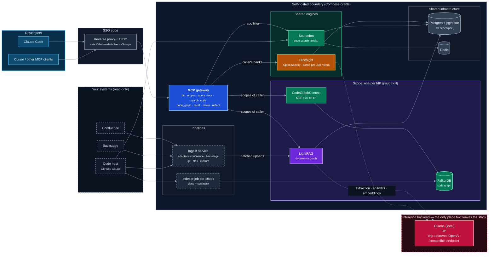
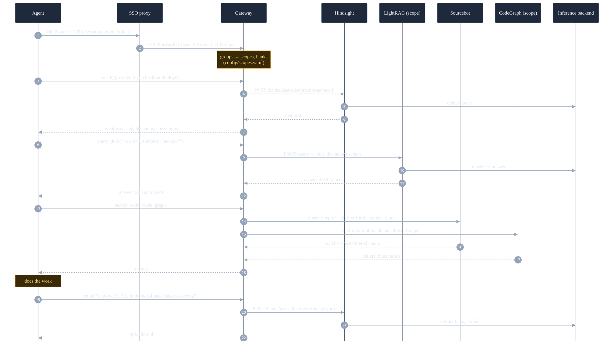
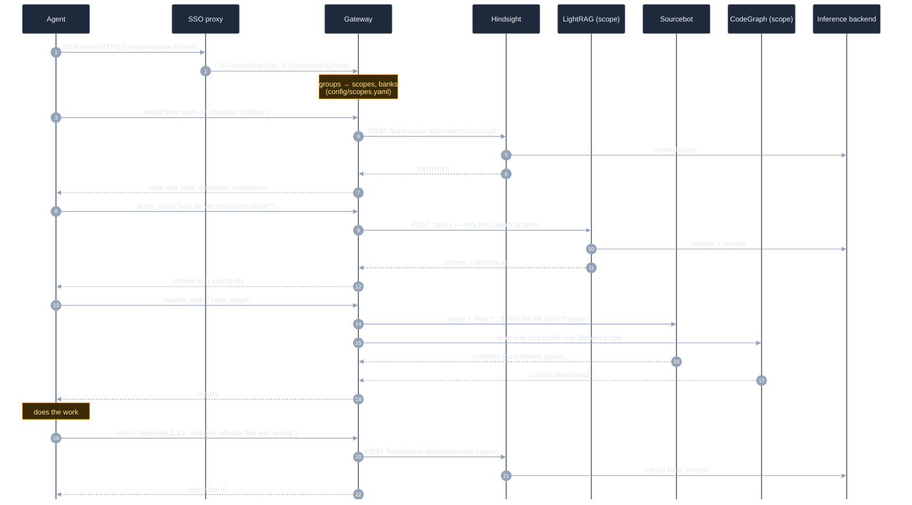

# Architecture

One MCP endpoint per developer; behind it three engines, isolated per scope; one shared inference backend that is the
only place text can leave the stack.

> **Viewing tip.** Each diagram is also rendered as an SVG you can open on its own and zoom without limit:
> [img/system.svg](img/system.svg) and [img/task-flow.svg](img/task-flow.svg). Inline, GitHub shows a zoom/full-screen
> toolbar when you hover a diagram; VS Code's preview needs the *Markdown Preview Mermaid Support* extension and only
> scales with the whole preview (Cmd/Ctrl +). Regenerate the SVGs after editing a diagram: `make diagrams`.

## System

Mermaid source

**Reading it**

- **Blue** is the only thing agents talk to. The gateway computes the caller's scopes from the proxy's identity
  headers and never lets a request pick an engine, a scope or a memory bank it is not entitled to.
- **Purple / green** are duplicated per scope: a document graph and a code graph merge knowledge across their
  inputs, so the access boundary has to be the index itself, not a filter on results.
- **Amber** is shared but partitioned by bank: `user-<id>` private, `team-<group>` shared with that IdP group.
- **Red** is the one outbound dependency. Only LightRAG and Hindsight send text there; Sourcebot and
  CodeGraphContext use no model. Point it at local Ollama or at an endpoint your organisation controls.
- **Dashed** boxes are read-only sources; nothing is ever written back to them.

Colors are set explicitly (dark palette), so the diagrams look the same on GitHub light and dark themes.

## One task, end to end

Mermaid source

The identity headers are the whole trust model: they exist only because the proxy is the single route to the
gateway. Everything downstream carries service credentials that clients never see (LightRAG API key, Hindsight
tenant key, Sourcebot API key).
